# Kawã Viana

### Desenvolvedor Backend em formação · Ciência da Computação · Java, Spring Boot, SQL

 

<h3><code>kawa@github ~ $ ./contribuicoes.sh</code></h3>

  

<h3><code>kawa@github ~ $ whoami</code></h3>
<table>
  <tr>
    <td valign="top"></td>
    <td valign="top"></td>
  </tr>
</table>

 

<h3><code>kawa@github ~ $ systemctl status fluxo-de-gestao</code></h3>

Formando em Ciência da Computação, com foco em desenvolvimento backend. Meu principal projeto é um sistema de gestão financeira que construí de ponta a ponta para uma empresa de guincho e que hoje roda em produção, usado pela equipe no dia a dia. Também desenvolvo aplicações Android em Java.

---

## Tecnologias

- **Uso em projetos:** Java, Spring Boot, APIs REST, PostgreSQL, React, TypeScript, Git/GitHub, Vercel
- **Android:** Java, Android SDK
- **Estudando agora:** JUnit 5, Mockito, SQL avançado, JDBC, Docker

## Projetos em destaque

<code>$ cat projetos/fluxo-de-gestao.md</code> — gestão financeira em produção para um cliente real

 

Sistema de gestão financeira para empresas de guincho — dashboard, DRE, controle de frota e conciliação de relatórios — em produção para um cliente real, sob a marca ANAIV. O status ao vivo está logo acima.

**Stack:** Java · Spring Boot · PostgreSQL · React · TypeScript 
**Links:** [código (versão demo)](https://github.com/Kawa-Vinicius-Dev/gestao-guincho-demo)

<code>$ cat projetos/pedeai.md</code> — pedidos de restaurante, da mesa à cozinha

 

Gestão de pedidos para restaurantes: pedidos de vários canais (balcão, mesa, telefone, iFood), cozinha, impressão térmica e financeiro básico.

**Stack:** Java · Spring Boot · React · TypeScript 
**Links:** [código](https://github.com/Kawa-Vinicius-Dev/pedeai) · [demo](https://pedeai-phi.vercel.app)

<code>$ cat projetos/inventario-rfid.md</code> — inventário patrimonial com leitor RFID no Android

 

Aplicativo Android para inventário patrimonial: leitura RFID, validação por loja/setor e exportação de relatórios.

**Stack:** Java · Android · SQLite 
**Links:** [código](https://github.com/Kawa-Vinicius-Dev/app-leitura-rfid)

<code>$ cat projetos/cardapio-digital.md</code> — cardápio online para um negócio real

 

Cardápio online para um negócio real, com pedidos via WhatsApp, carrinho e taxa de entrega por bairro.

**Stack:** React · TypeScript 
**Links:** [código](https://github.com/Kawa-Vinicius-Dev/laura-cake-cardapio-digital)

## Em formação

Estou seguindo uma [**trilha de backend Java**](https://github.com/Kawa-Vinicius-Dev/protocolo-carrasco-java): 247 exercícios de Java, testes (JUnit, Mockito), SQL, JDBC e HTTP antes de aprofundar em Spring. A barra de progresso no log acima é atualizada automaticamente a partir do repositório.

## Contato

Aberto a oportunidades como desenvolvedor Java / Backend (júnior, trainee ou estágio).

